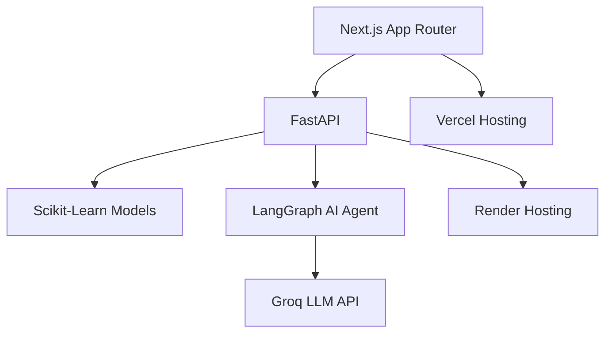
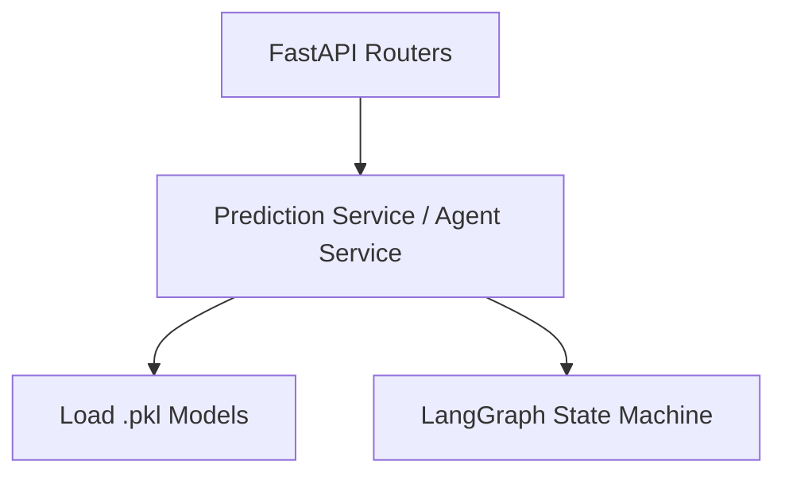

## 1. Architecture Design

## 2. Technology Description
- **Frontend Framework**: Next.js 14 (App Router)
- **UI Library**: React (Server Components + Client Components)
- **Styling**: Tailwind CSS + Shadcn UI
- **Animations**: Framer Motion
- **Data Visualization**: Recharts
- **Icons**: Lucide React
- **State Management**: React Context / Zustand (if complex state is needed)
- **Data Fetching**: SWR or native `fetch` with React Suspense
- **Initialization Tool**: `create-next-app`

## 3. Route Definitions
| Route | Purpose |
|-------|---------|
| `/` | Landing page with hero section and primary CTA |
| `/dashboard` | Main layout shell (sidebar + topnav) |
| `/dashboard/explorer` | Data Explorer with interactive Recharts |
| `/dashboard/predict` | ML Yield Prediction input form and results |
| `/dashboard/advisory` | Agentic AI Farm Advisory report generator |

## 4. API Definitions (Interacting with FastAPI Backend)
- `POST /api/predict`
  - Request: `{ area: string, item: string, year: number, rainfall: number, pesticides: number, avg_temp: number }`
  - Response: `{ yield_hg_ha: number, yield_tonnes_ha: number, feature_importance: Record<string, number> }`
- `POST /api/advisory`
  - Request: `{ ...farmData, predicted_yield: number, groq_api_key: string }`
  - Response: `{ report: string }`

## 5. Server Architecture Diagram (FastAPI Backend)

## 6. Data Model
*No complex database required. The application relies on static historical datasets (`yield_df.csv`) loaded into memory by the FastAPI backend, and stateless model predictions.*